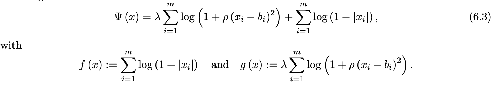

## CoCaIn BPG: Fast Inertial Algorithm for Non-convex Optimization

## [Convex-Concave Backtracking for Inertial Bregman Proximal Gradient Algorithms in Non-Convex Optimization](https://arxiv.org/abs/1904.03537) 
by Mahesh Chandra Mukkamala, Peter Ochs, Thomas Pock and Shoham Sabach.

### Code theme: CoCaIn BPG escapes Spurious Stationary Points

The goal is to minimize the following non-convex objective  (as in Page 18)

The objective function visualizations are given below (as in Page 19). 

###
### Dependencies
- numpy, matplotlib 

If you have installed above mentioned packages you can skip this step. Otherwise run  (maybe in a virtual environment):

    pip install -r requirements.txt

## Reproduce results

To generate results 

    chmod +x generate_results.sh
    ./generate_results.sh

Then to create the plots
    
    python contour_plot.py

Now you can check **figures** folder for various figures. 

## Results

## Citation

    @techreport{MOPS19,
    title        = {Convex-Concave Backtracking for Inertial Bregman Proximal Gradient Algorithms in Non-Convex Optimization},
    author       = {M.C. Mukkamala and P. Ochs and T. Pock and S. Sabach},
    year         = {2019},
    journal      = {ArXiv e-prints, arXiv:1904.03537},
    }

## [Related work: CoCaIn BPG for Matrix Factorization](https://github.com/mmahesh/cocain-bpg-matrix-factorization)

## Contact 
Mahesh Chandra Mukkamala (mukkamala@math.uni-sb.de)

## References

M. C. Mukkamala, P. Ochs, T. Pock, and S. Sabach: Convex-Concave Backtracking for Inertial Bregman Proximal Gradient Algorithms in Non-Convex Optimization. ArXiv e-prints, arXiv:1904.03537, 2019.

## License

[Check here.](LICENSE)

